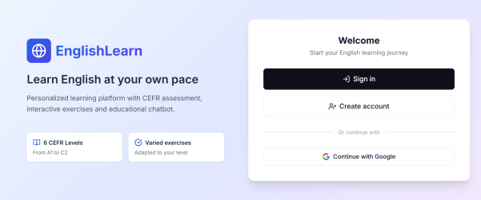
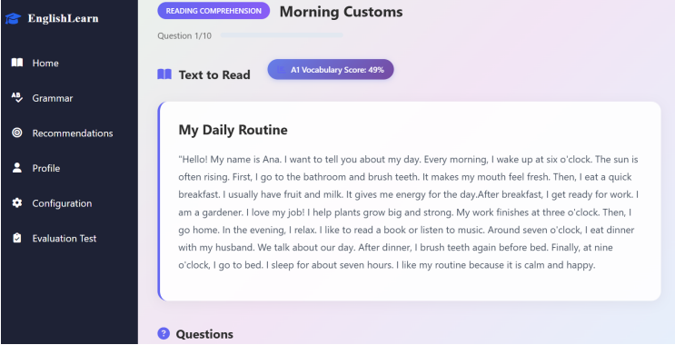
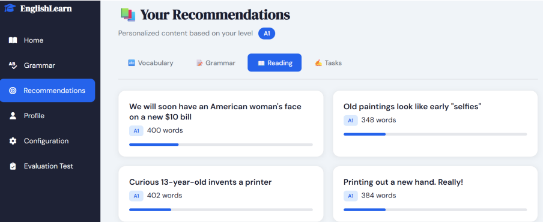
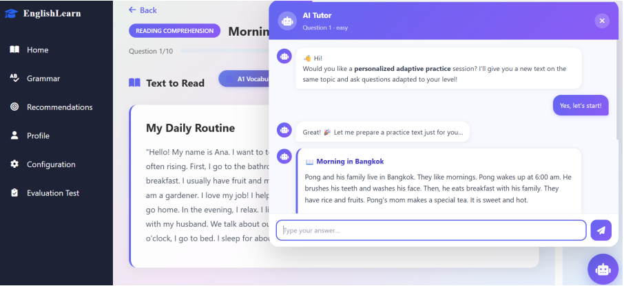
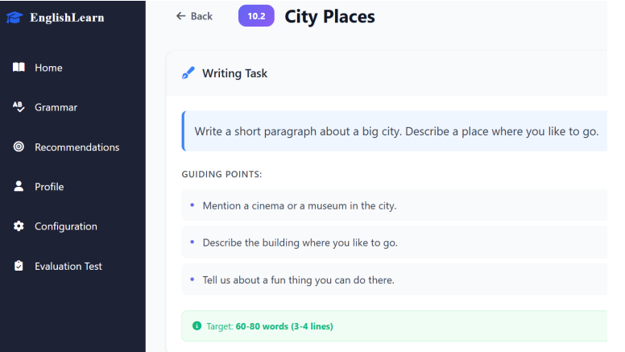
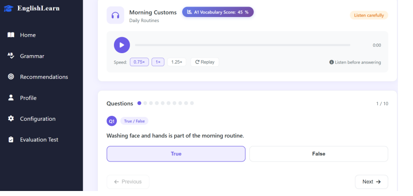
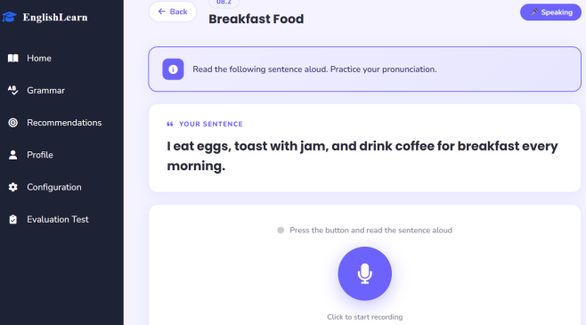

# 🎓 AI-Powered Adaptive English Learning Platform

An intelligent English learning platform that combines **Graph Neural Networks (HIER-GNN)**, **Knowledge Graphs**, and a **Multi-Agent Large Language Model (LLM)** architecture to provide personalized learning recommendations and adaptive educational content.

---

## 📌 Overview

This project was developed as a Master's thesis to improve English language learning through Artificial Intelligence.

The platform personalizes each learner's experience by combining:

- 📚 Personalized activity recommendation using **HIER-GNN**
- 🤖 Dynamic exercise generation using a **Multi-Agent LLM system**
- 📈 Adaptive learning based on learner progress
- 🎯 CEFR-based difficulty adaptation (A1–C2)

---

## ✨ Features

- User authentication
- CEFR placement test
- Reading, Writing, Listening and Speaking activities
- Personalized recommendations
- Adaptive learning path
- AI-generated exercises
- Automatic answer evaluation
- Personalized feedback
- Grammar and vocabulary correction
- Learner dashboard

---

## 🏗️ System Architecture


The platform is composed of two main AI modules:

- **HIER-GNN Recommendation System**
- **Multi-Agent LLM Framework**

These modules work together to recommend appropriate activities and generate personalized educational content.

---

## 🤖 AI Components

### HIER-GNN Recommendation System

- Graph Neural Network
- Knowledge Graph integration
- Personalized recommendation
- Student interaction graph

### Multi-Agent LLM

- Agent 1: Learner performance analysis
- Rule-based adaptation module
- Agent 2: Exercise and feedback generation

---

## 🛠️ Technologies

- Python
- Django
- PyTorch
- PostgreSQL
- Neo4j
- Hugging Face Transformers
- Llama 3
- HTML
- CSS
- JavaScript

---

## 📊 Experimental Results

The proposed approach achieved better recommendation performance than traditional GNN-based methods by integrating Knowledge Graph information and adaptive learner modeling.

---

## 📸 Application Preview

### 🏠 Home Page

<p align="center">

</p>

The landing page introduces the platform and provides access to authentication

---

### 📊 Learner Dashboard

<p align="center">

</p>

A personalized dashboard displaying learner progress, activity history, recommendations, and performance statistics.

---

### 📖 Reading Activity

<p align="center">

</p>

Interactive reading exercises with comprehension questions and adaptive difficulty levels based on the learner's profile.

---

### 🤖 Personalized Recommendations

<p align="center">

</p>

Recommendations generated by the HIER-GNN model using learner interactions, preferences, and knowledge graph information.

---
### 🧠 Multi-Agent LLM Framework

<p align="center">

</p>

The platform employs a Multi-Agent Large Language Model architecture composed of:

- **Analysis Agent** for learner response evaluation.
- **Rule-Based Adaptation Module** for pedagogical decision-making.
- **Generation Agent** for creating personalized exercises and feedback.

This collaborative workflow enables dynamic content generation and adaptive learning tailored to each learner.

---
### ✍️ Writing Activity

<p align="center">

</p>

Writing exercises automatically evaluated by the AI-powered assessment module, providing personalized feedback and corrections.

---

### 🎧 Listening Activity

<p align="center">

</p>

Listening comprehension exercises designed according to CEFR levels and learner preferences.

---

### 🎤 Speaking Activity

<p align="center">

</p>

Speaking exercises allowing learners to practice pronunciation and oral expression.

---

## 📦 Large Resources

Large resources are hosted on Kaggle because they exceed GitHub's file size limit.

They include:

- Trained HIER-GNN model
- Knowledge Graph
- Student interaction graph
- Database dump

👉 https://www.kaggle.com/datasets/afaffarahzenaini/ai-english-learning-recommendation-resources

---

## 🚀 Installation

```bash
git clone https://github.com/zenainiafaf/AI-Powered-Adaptive-English-Learning-Platform.git
```

Install dependencies

```bash
pip install -r requirements.txt
```

Run

```bash
python manage.py runserver
```

---

## 👩‍💻 Author

**Farah Zenaini**

Master's Thesis – USTHB

2026
