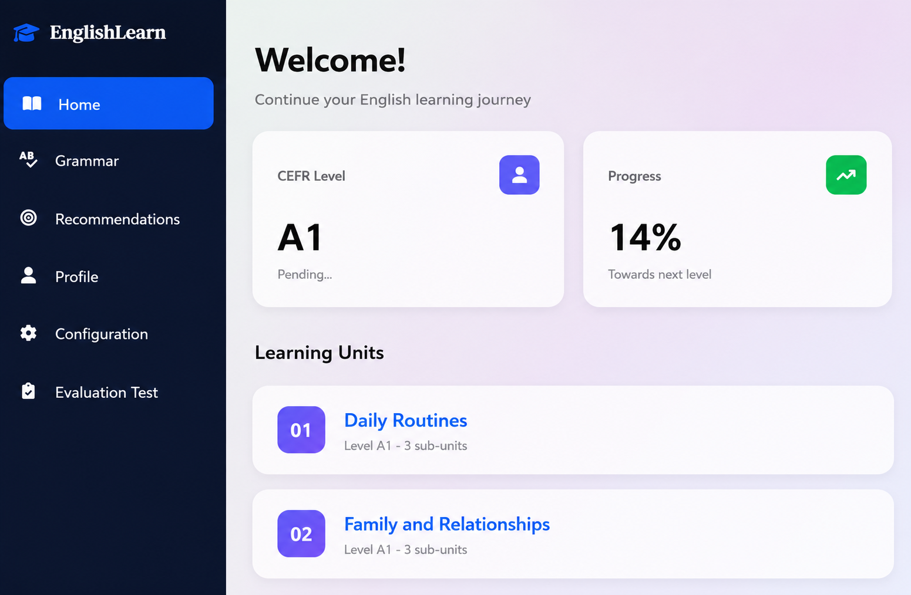

# 🎓 AI-Powered Adaptive English Learning Platform

An intelligent English learning platform that combines **Graph Neural Networks (HIER-GNN)**, **Knowledge Graphs**, and a **Multi-Agent Large Language Model (LLM)** architecture to provide personalized learning recommendations and adaptive educational content.

---

## 📌 Overview

This project was developed as a Master's thesis to improve English language learning through Artificial Intelligence.

The platform personalizes each learner's experience by combining:

- 📚 Personalized activity recommendation using **HIER-GNN**
- 🤖 Dynamic exercise generation using a **Multi-Agent LLM system**
- 📈 Adaptive learning based on learner progress
- 🎯 CEFR-based difficulty adaptation (A1–C2)

---

## ✨ Features

- User authentication
- CEFR placement test
- Reading, Writing, Listening and Speaking activities
- Personalized recommendations
- Adaptive learning path
- AI-generated exercises
- Automatic answer evaluation
- Personalized feedback
- Grammar and vocabulary correction
- Learner dashboard

---

## 🏗️ System Architecture


The platform is composed of two main AI modules:

- **HIER-GNN Recommendation System**
- **Multi-Agent LLM Framework**

These modules work together to recommend appropriate activities and generate personalized educational content.

---

## 🤖 AI Components

### HIER-GNN Recommendation System

- Graph Neural Network
- Knowledge Graph integration
- Personalized recommendation
- Student interaction graph

### Multi-Agent LLM

- Agent 1: Learner performance analysis
- Rule-based adaptation module
- Agent 2: Exercise and feedback generation

---

## 🛠️ Technologies

- Python
- Django
- PyTorch
- PostgreSQL
- Neo4j
- Hugging Face Transformers
- Llama 3
- HTML
- CSS
- JavaScript
- Bootstrap

---

## 📊 Experimental Results

The proposed approach achieved better recommendation performance than traditional GNN-based methods by integrating Knowledge Graph information and adaptive learner modeling.

<p align="center">

</p>

---

## 📸 Application Preview

| Login | Dashboard |
|-------|-----------|
|  |  |

| Reading | Recommendations |
|---------|-----------------|
|  |  |

---

## 📦 Large Resources

Large resources are hosted on Kaggle because they exceed GitHub's file size limit.

They include:

- Trained HIER-GNN model
- Knowledge Graph
- Student interaction graph
- Database dump
- Preprocessed datasets

👉 https://www.kaggle.com/datasets/afaffarahzenaini/ai-english-learning-recommendation-resources

---

## 🚀 Installation

```bash
git clone https://github.com/your-username/AI-Powered-Adaptive-English-Learning-Platform.git
```

Install dependencies

```bash
pip install -r requirements.txt
```

Run

```bash
python manage.py runserver
```

---

## 👩‍💻 Author

**Farah Zenaini**

Master's Thesis – USTHB

2026
